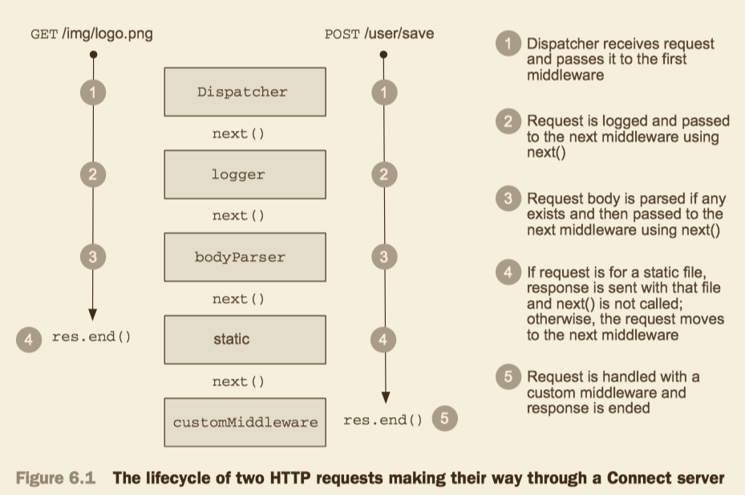

### TODO
- [x] Setting up a Connect application
- [x] How Connect middleware works
- [x] Why middleware ordering matters
- [x] Mounting middleware and servers
- [x] Creating configurable middleaware
- [x] Using error-handling middleware

### Basic about Connect
In Connect, a middleware component is a function that intercepts the request and response objects provided by the HTTP server, execute logic, and then either ends the response or passed it to the next middleware component. Connect 'connects' the middlewares together using what's called the `dispatcher`.

### How Connect middleware works
In Connect, a middleware component is a JavaScript function that by convention accepts three arguments: a request object, a response object, and an argument commonly named `next`, which is a callback function indicating that the component is done and the next middleware component can be executed.

### Session Handle 
